プロジェクトを作成
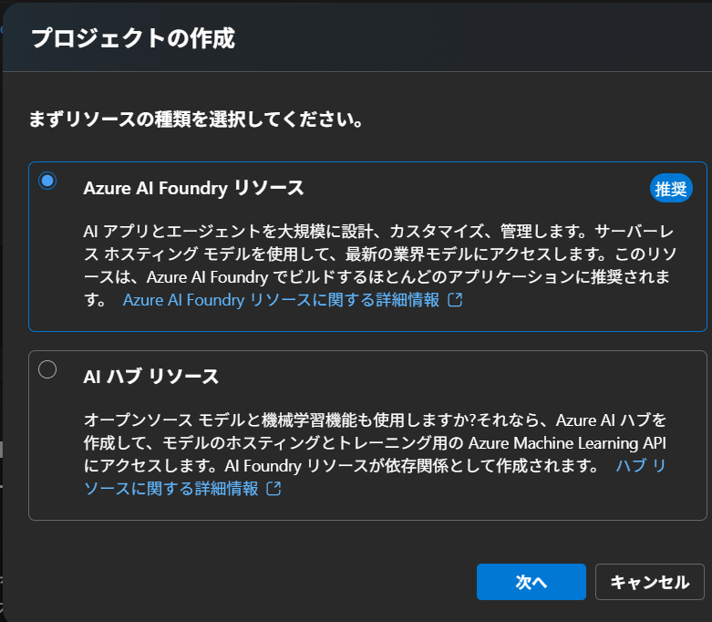

プロジェクト名：copilot-for-everything
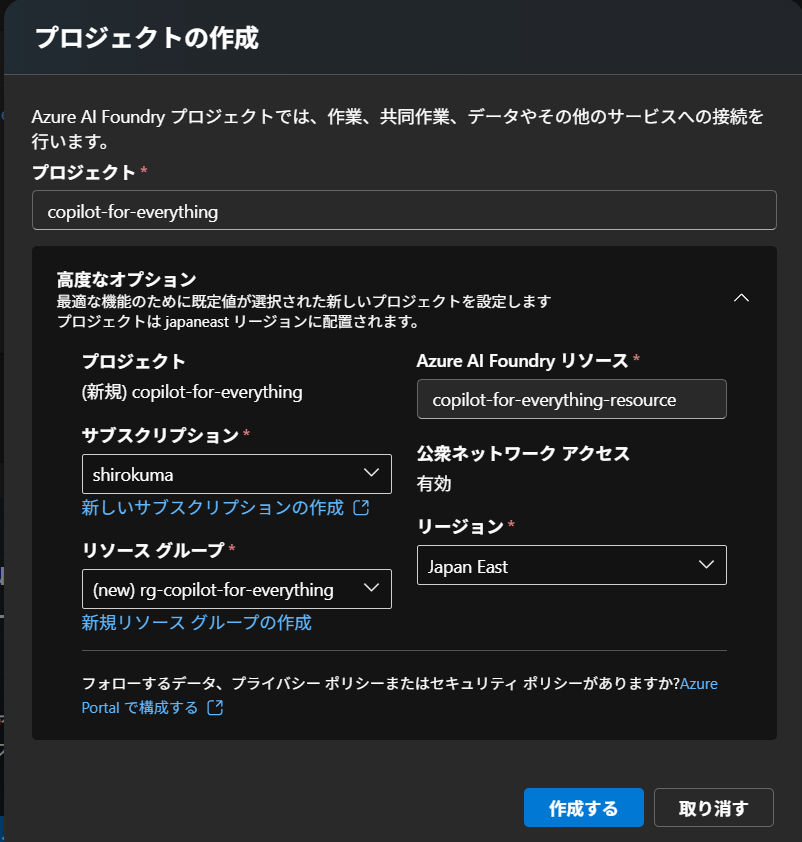

Agentsページへ。
まずLLMモデルをデプロイ。ここではgpt-4.1
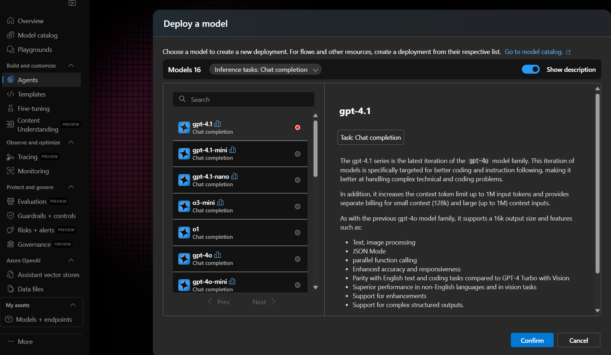

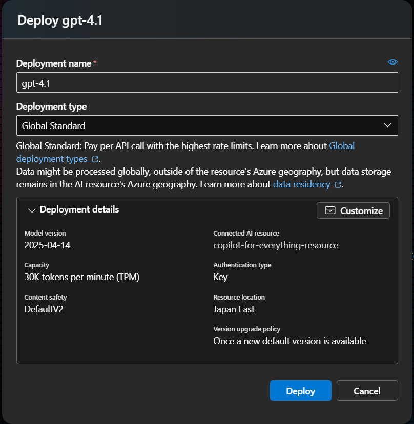

Agent名
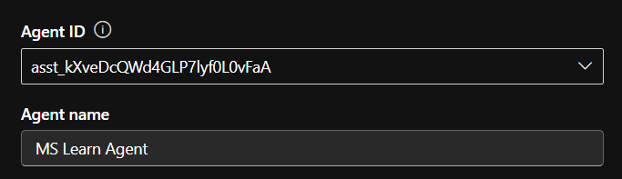

Knowledgeに追加
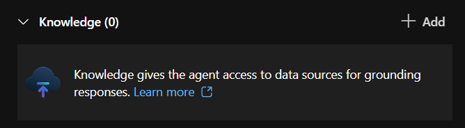


Grounding with Bing Custom Search connection を選ぶ
※[Grounding with Bing Searchとの違い](../BingSearch_vs_BingSearchCustomSearch.md)

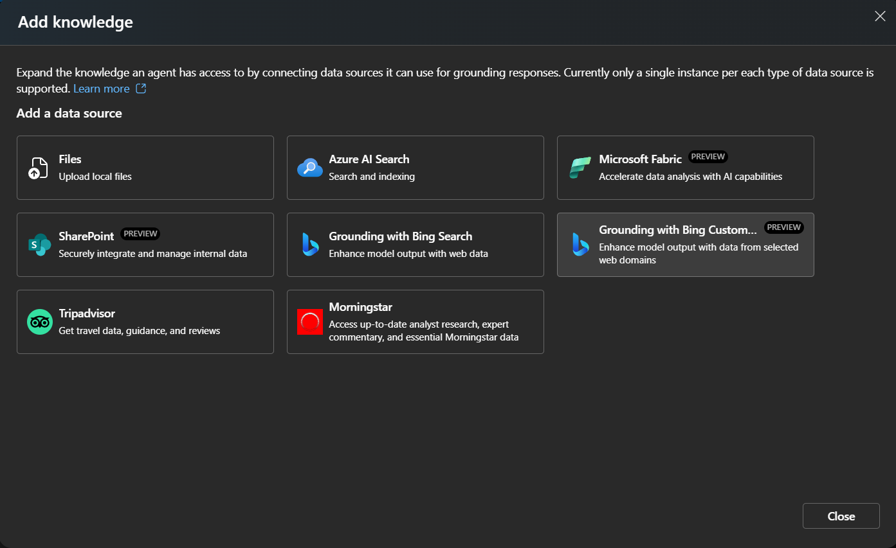

Bing Search リソースとのConnectionを作成。
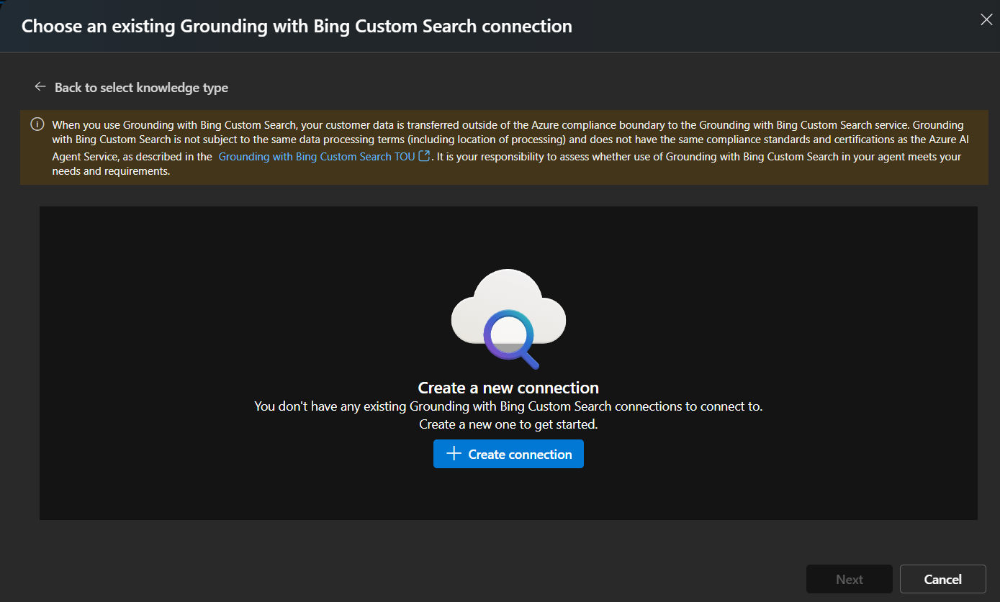

まずはBing Searchリソースを作成
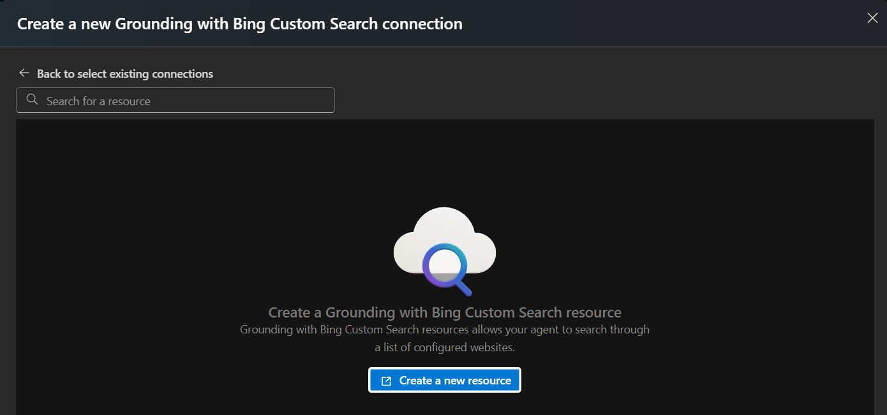

Azure Portalに遷移してCustom Bing Searchを作成
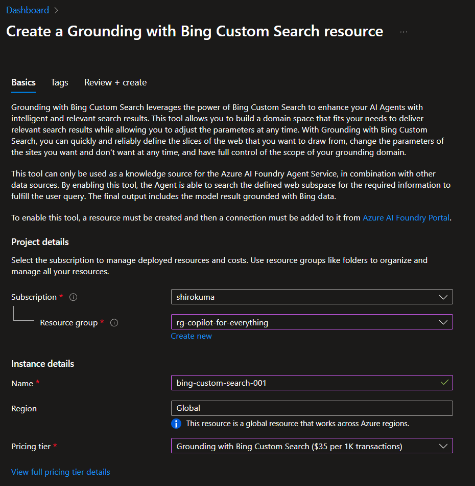

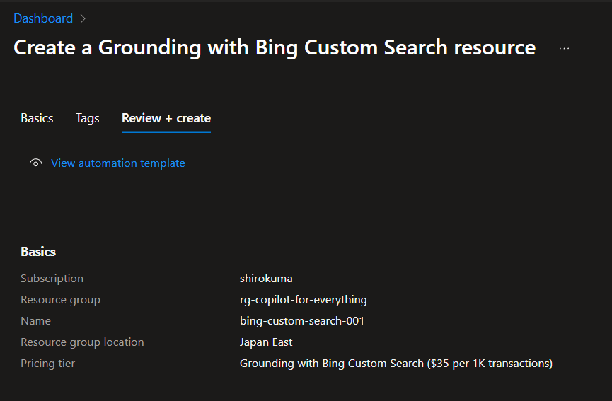

作成完了
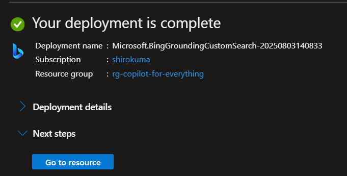

configurationを作成する。ドメインを指定した検索にする
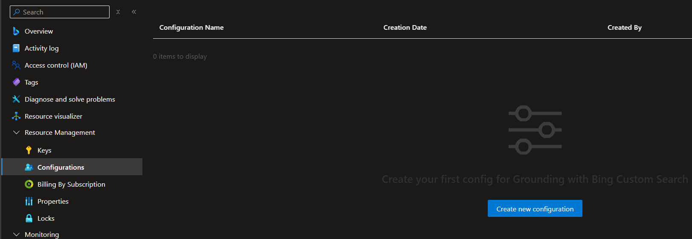

Webアドレスにlearnを追加
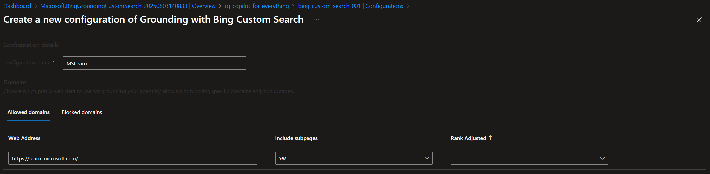

Rank adjusted
- Rank Adjustedはそのページを優先的に検索をかけるブースト機能。おそらく検索スコアが何倍かされる仕様だと思われる。
  - Boost, Super Boost は優先度を上げる。
  - Demote は優先度を下げる

作成完了
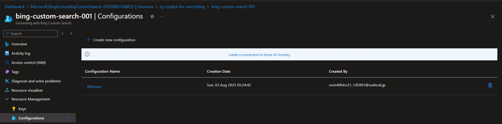


AI Foundry に戻って、一つ前のcreate connectionをやり直し。
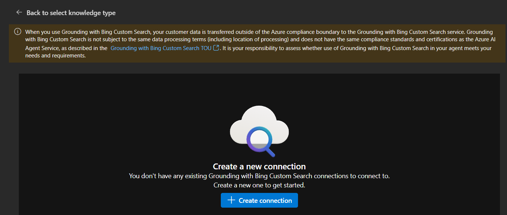

作成したbing custom searchが選ばれる
右上のAdd connection で追加
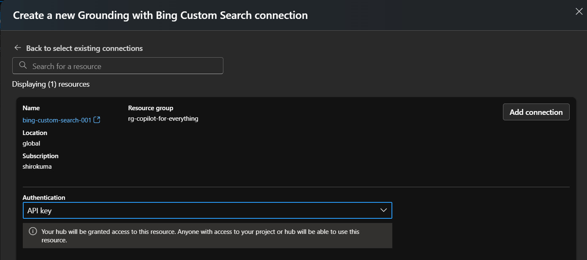

configurationがないといわれる。
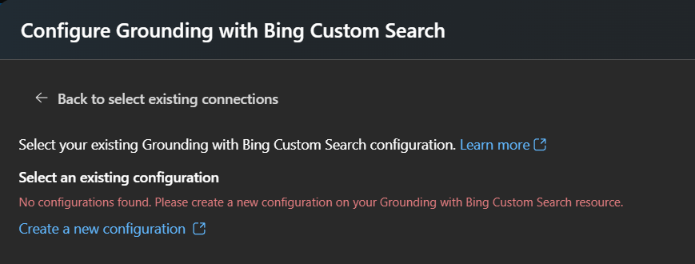


作成したBing Custom SearchのConnectionをKnowledgeに指定
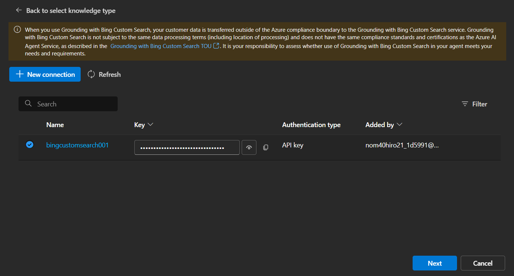

設定はデフォルトのままで。
- Count：
- Set Language：
- Market：
- Freshness：
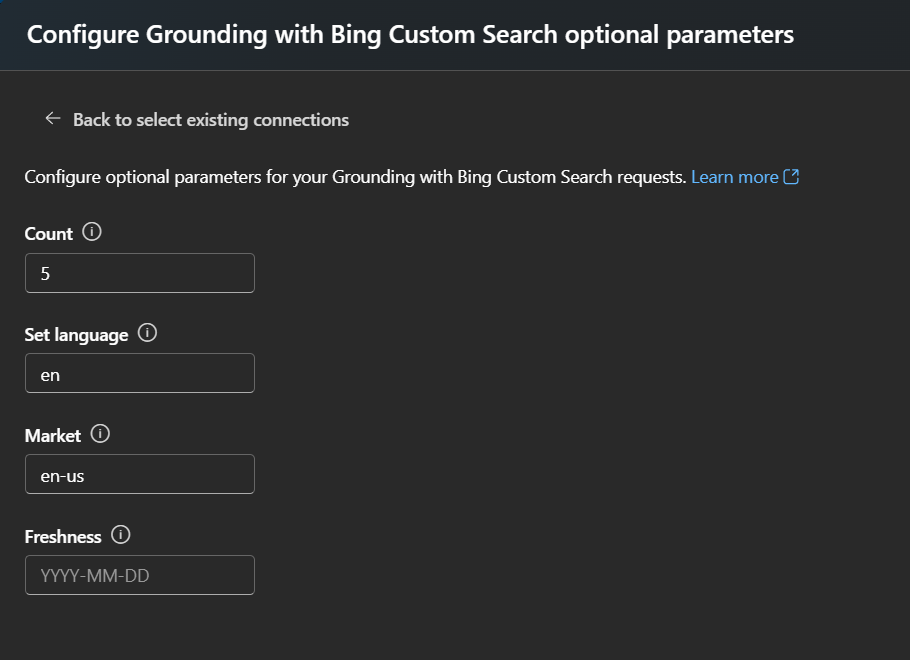

Configurationは作成したMSLearnを指定


最後にInstructionを設定
```
BingCustomSearchを使って質問に答えてください。
```

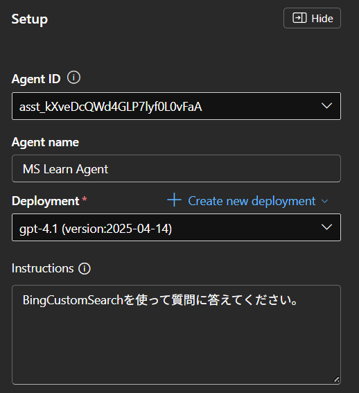

### 動作確認
通常のChatPlaygroundと比較
```text
Azure AI Foundry エージェントがMCPサーバのツールを使うことはできる？
```

```text
AI Foundry で、MS Learnのサイトを検索するエージェントを作成したいです。もっとも簡単なやり方を教えて！
```

```text
Azure AI Foundry のAI Red Teaming Agent とはなに？
```


### 注意事項
開発者とエンド ユーザーは、Bing Custom Search を使用して Grounding から返された生コンテンツにアクセスできません。 ただし、モデルの応答には、応答の生成に使用される Web サイトへのリンクを含む引用が含まれており、Agents Service によって提供されるメカニズムを使用して保存できます。    